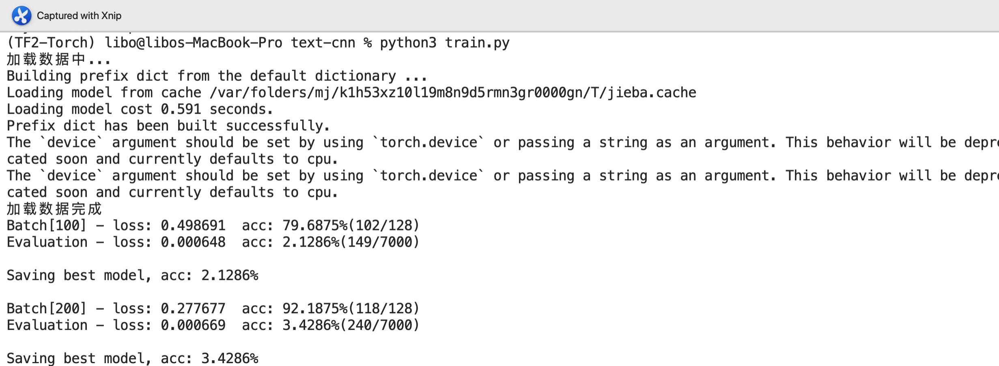
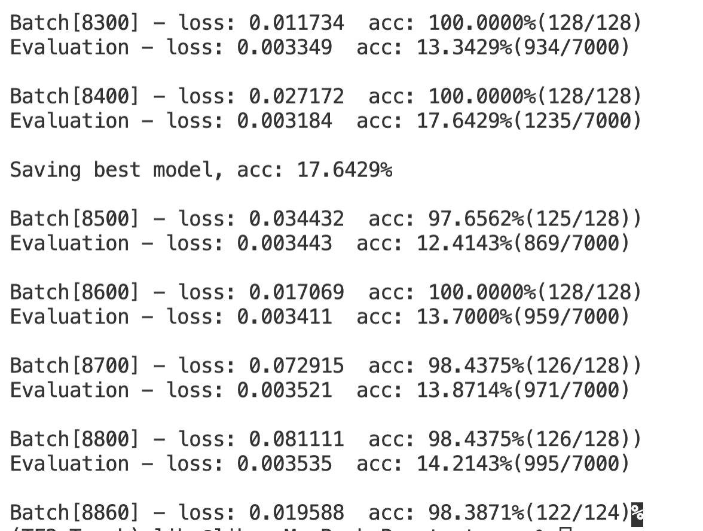
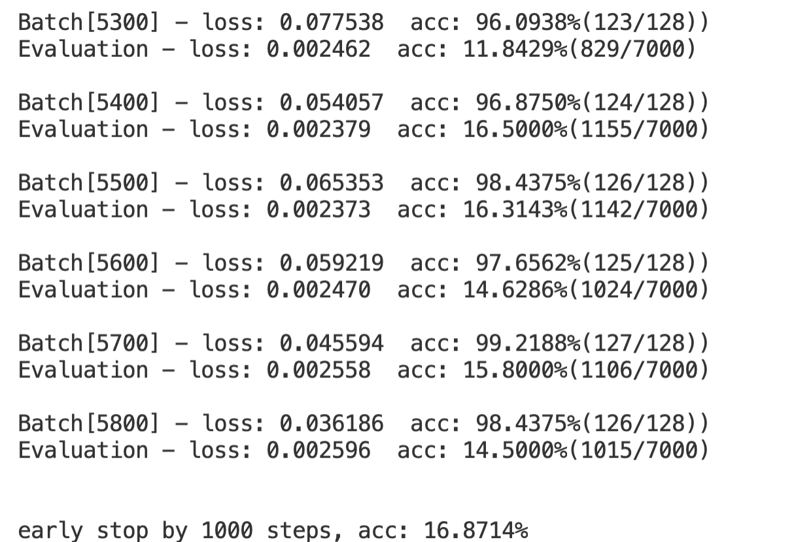

## 基于TextCNN的文本分类作业要求
- 数据处理和载入
- 可以自己从头实现也可以实现torch的DataLoader
- 继承和重载函数
- 汇报准确率

## 作业代码说明
- 本次作业通过data_processor.py替代torch 的DataLoader
- 通过model.py建立TextCNN模型* 使用torchtext库来进行文本处理，包括以下几个部分：
	* 分词：torchtext使用jieba分词器作为tokenizer
	* 去停用词：加载去停用词表，并在data.Field中设置
		* text = data.Field(sequential=True, lower=True, tokenize=tokenizer, stop_words=stop_words)
	* 文本长度padding：如果需要设置文本的长度，则在data.Field中设置fix_length,否则torchtext自动将文本长度处理为最大样本长度
	* 词向量转换：torchtext能自动建立word2id和id2word两个索引，并将index转换为对应词向量，如果要加载预训练词向量，在build_vocab中设置即可
  
-  通过 train.py 文件随机初始化Embedding进行
 ```python
python3 train.py
```

得到如下结果：




通过early stop得到使用batch得到的准确度为98.4375%,但是评估得到的准确度最高为16.87%